# Travailler avec un csv en SQL depuis dataCamp sans rien installer

Petite astuce pour travailler sans installer de serveur SQL, depuis datacamp en utilisant DataLab pour faire des requêtes SQL. 
Le plan gratuit permet d'avoir un petit DataLab

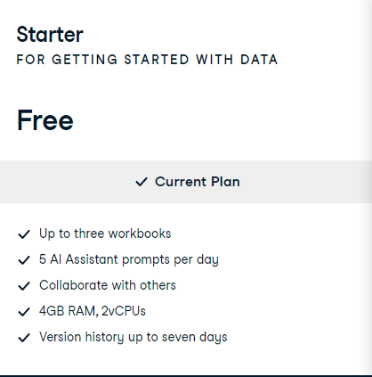

## Transformer un csv en source SQL dans datacamp

Voici l'exemple avec le fichier csv des suicides en Inde que vous pouvez télécharger à [l'adresse officiel](https://www.kaggle.com/datasets/rajanand/suicides-in-india)

Télécharger le fichier csv sur votre machine (vous pourrez le supprimer ensuite)

Connecter vous à votre Datacamp:

Allez dans DataLab, puis choissisez **Data Sources**

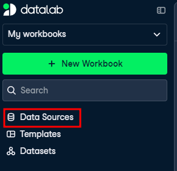

Cliquez sur **New Data Source**

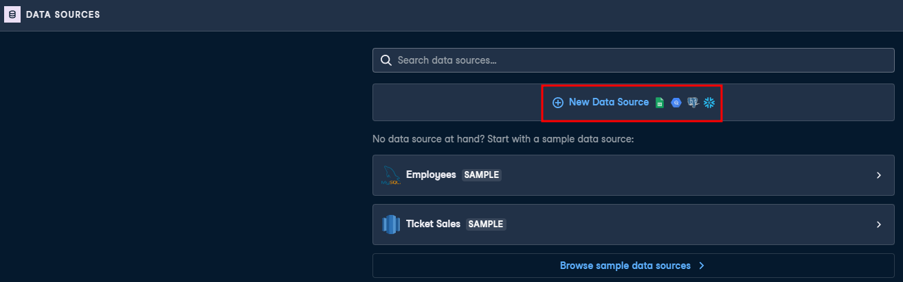

Ici vous allez pouvoir faire un drag and drop du fichier csv que vous avez téléchargé précédemment

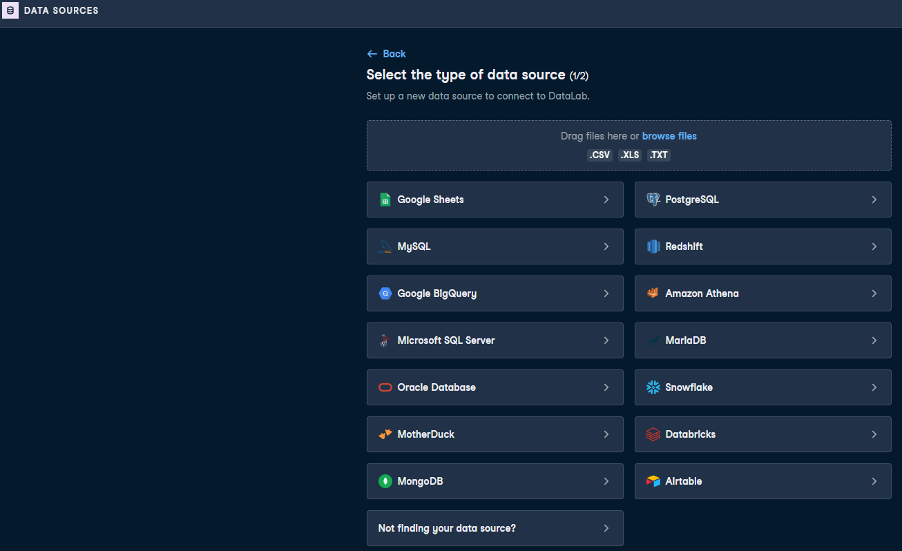

La fenetre va s'agrandir d'un coup, déposer le fichier

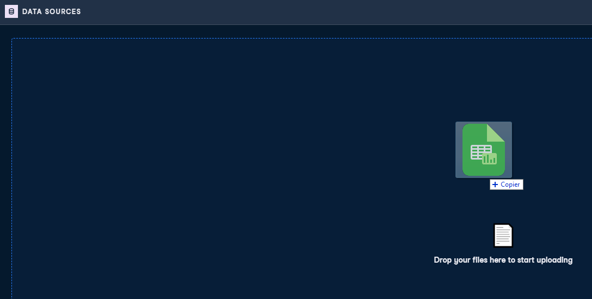

Le fichier va être importé sur le data source du dataLab

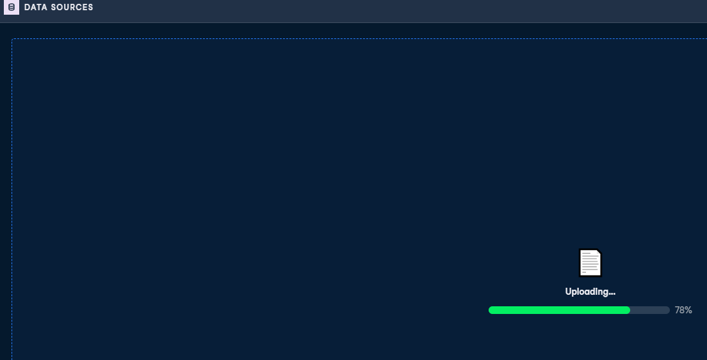

Il sera ensuite analysé et un affichage des 100 premieres lignes sont proposées

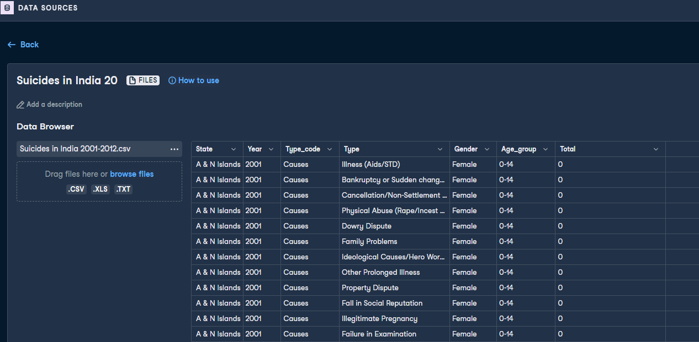

Cliquez ensuite sur le bouton **New Workbook**

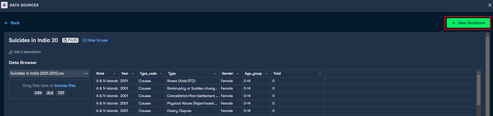

Vous avez ensuite un petit encard SQL qui vous permet de taper votre commande, en cliquant sur **Run** vous executez cette commande sur votre base de données fraichement montée.

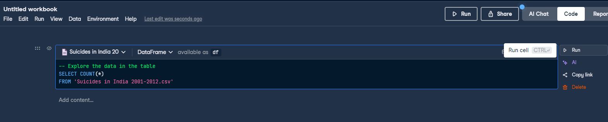

Ici je vérifie d'avoir le bon nombre d'enregistrement avec un *select count*

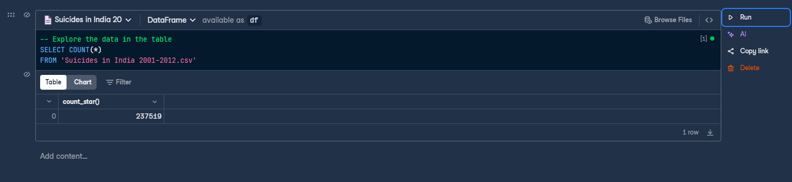

le resultat de la commande est stocké dans un *dataframe* (ici df)

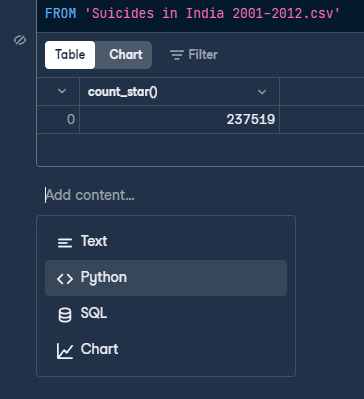

comme vous pouvez le voir, avec un info sur le dataframe, on obtient les détails de celui-ci

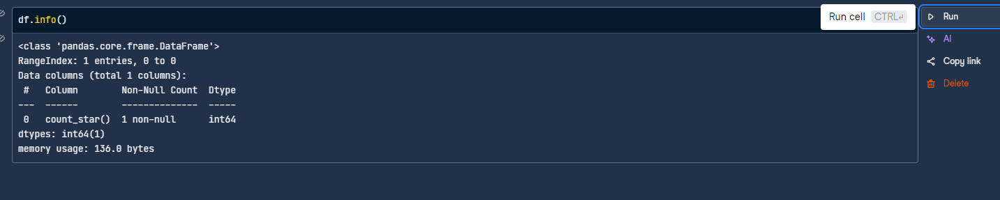

Ici je vais charger dans un data frame df1 la totalité de la table Suicide

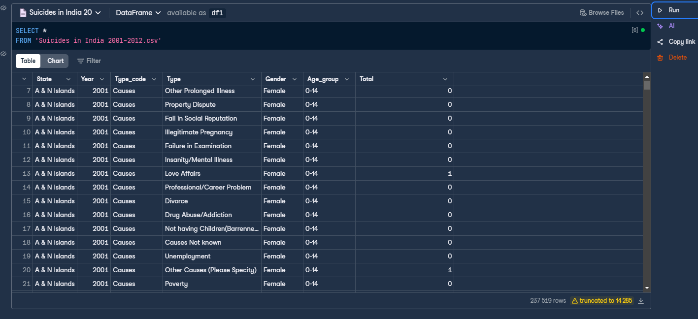

Je vérifie le contenu de mon dataframe

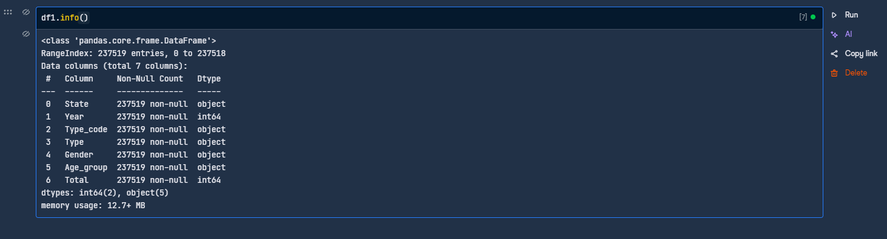

Autre exemple de requete SQL

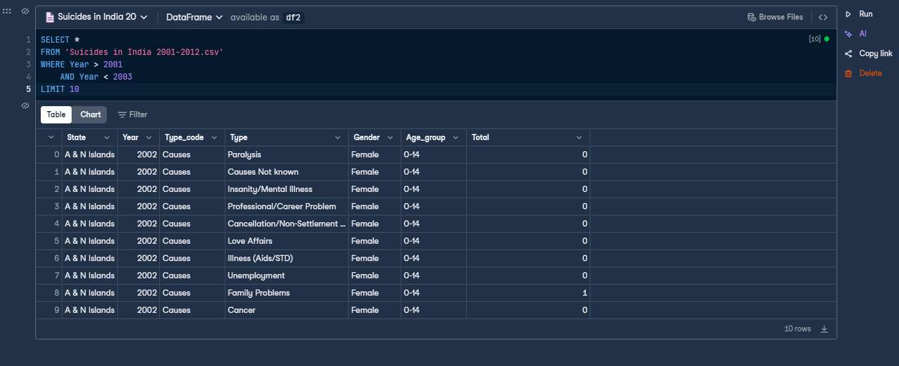

## Transformer un csv depuis une base Mysql et s'y connecter depuis dataCamp

Il est possible d'avoir une base de données mysql gratuitement à l'adresse suivante: [Site officiel](https://freedb.tech/) 

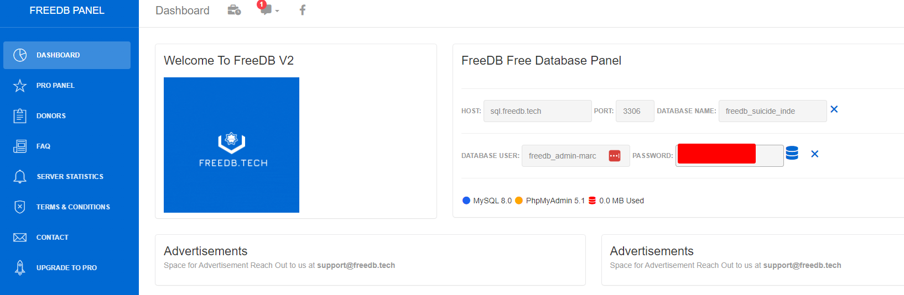

> Attention toutefois, on est limité à 100 connexions simultanément , il faut donc faire attention si vous importez le fichier suicide, depuis phpmyadmin, cela ne fonctionne pas.

> depuis dbeaver il faut décocher l'option "ouvrir connexion(s)" lors de l'import

Ensuite, dans votre *dataLab* rendez vous dans **data sources** comme précédemment et **New Data Source** puis choisissez **Mysql**

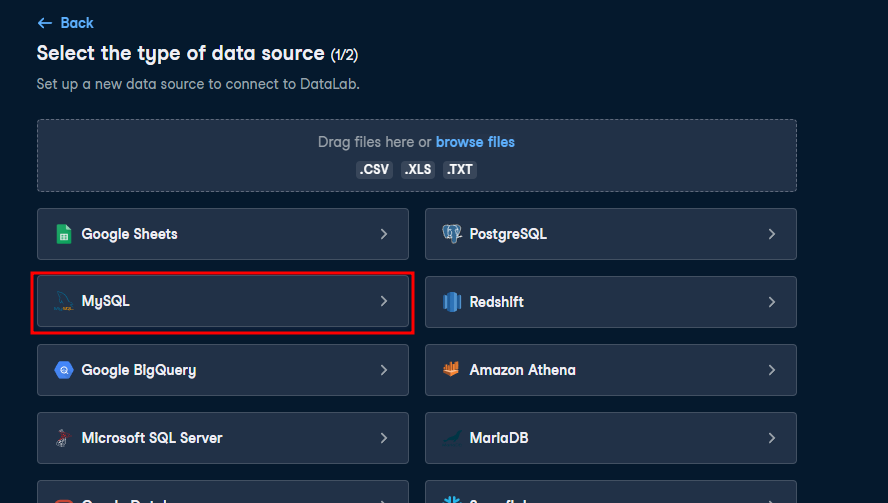

Compléter les informations de connexion

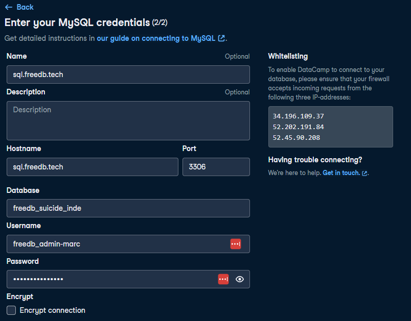

Vous aurez la validation de connexion, puis cliquez sur **continue**

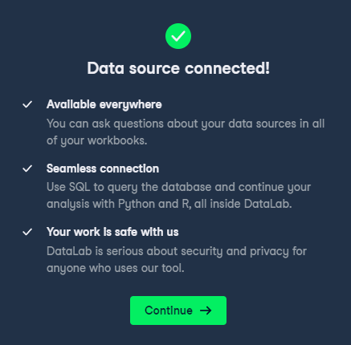

Et hop vous aurez cette fois-ci du pure SQL (par contre je ne sais pas le nombre de connexion qui sont ouvertes vers le serveur Mysql)

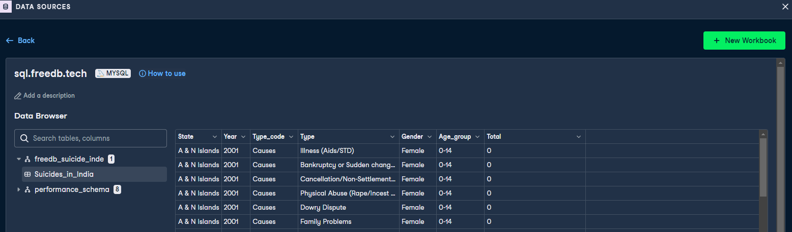

Cliquez sur **New Workbook** et vous pouvez jouer avec du SQL

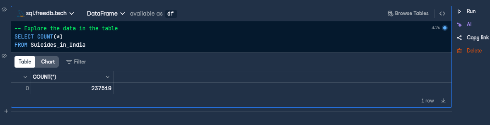