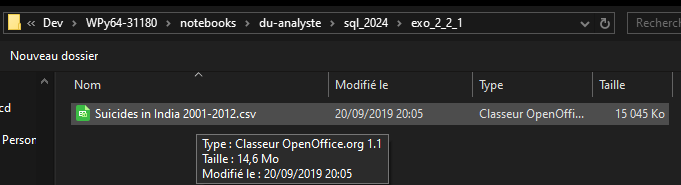

# Comment importer un csv dans une base Mysql avec dbeaver

Télécharger le logiciel à cette adresse et installez le: [site officiel dbeaver](https://dbeaver.io/download/)

Il faut ensuite lancer le logiciel

Compléter les informations avec les informations de votre serveur Mysql

Ensuite il faut se connecter

Selectionner le formatage souhaitez de votre base de données

Une fois que l'on est connecté il faut créé une base de données pour y importer les tables

Ensuite il faut selectionner la base de données et importer les données

Il est déjà configuré pour le format csv, il suffit de cliquer sur **suivant**

Selectionner son fichier csv

Continuer avec **suivant**

Continuer avec **suivant**

Continuer avec **suivant**

Demarrer l'import en cliquant sur **Commencer**
