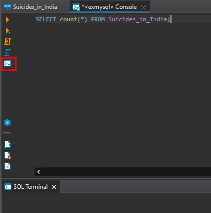

# faire des requêtes sql depuis dbeaver

Il faut tout d'abord se connecter à la base mysql de votre choix, puis se rendre sur la table cible sur laquelle on souhaite effectuer des opérations.

On effectue un double clic sur celle-ci, un menu apparait avec la mention SQL, dans le menu SQL choisir **Open SQL console**

Ensuite cliquez sur l'icone terminal (encadré en rouge dans l'image ci-dessous) pour ouvrir la fenêtre terminal afin d'avoir un affichage similaire à un serveur SQL.

Taper votre requête et cliquez sur la premiere icône encadré en rouge pour n'executez que la requête que vous venez de taper. Cela n'execute qu'une requête à la fois.

> Dbeaver est un client, il nécessite donc d'avoir un serveur SQL/Mysql/Mariadb pour se connecter à une session.